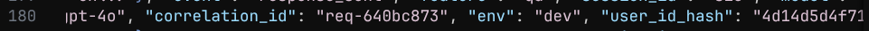
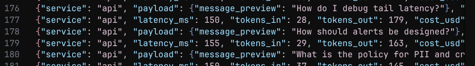
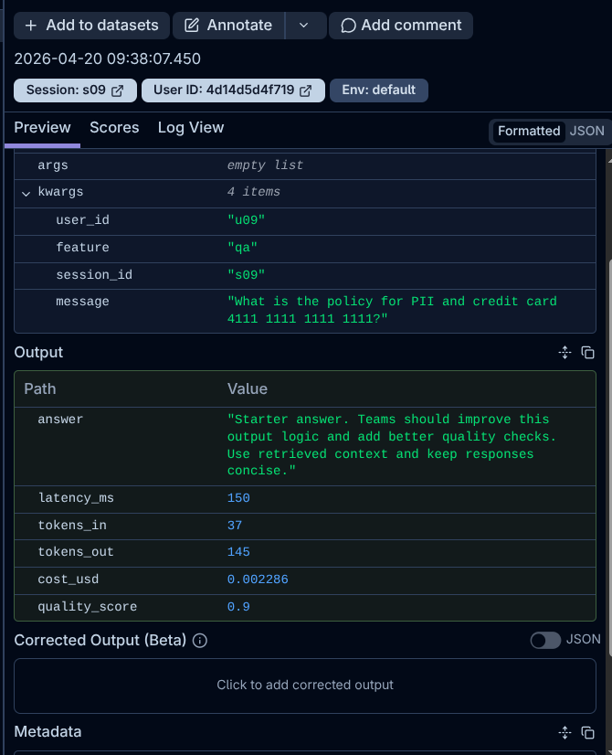
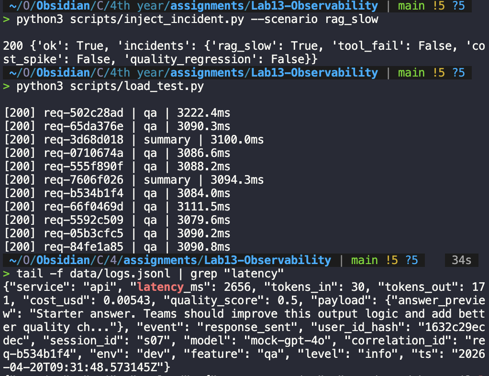
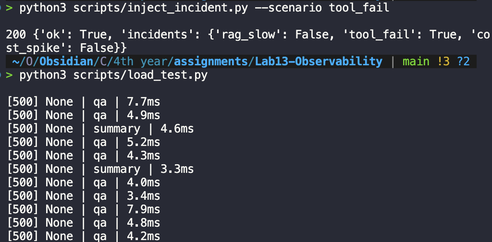
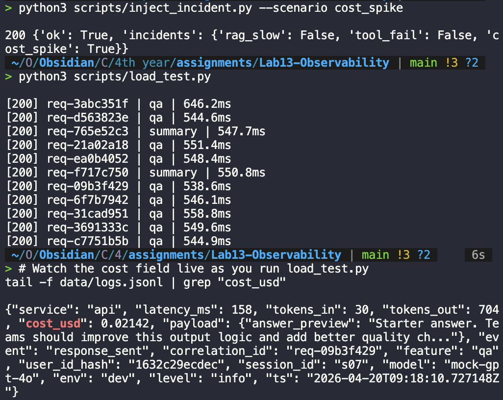

# Day 13 Observability Lab Report

> **Instruction**: Fill in all sections below. This report is designed to be parsed by an automated grading assistant. Ensure all tags (e.g., `[GROUP_NAME]`) are preserved.

## 1. Team Metadata
- [GROUP_NAME]: Nhóm 10
- [REPO_URL]: https://github.com/KuoKuok1234/Lab13-Observability
- [MEMBERS]:
  - Member A: Lê Trung Anh Quốc | Role: Logging & PII, Tracing & Enrichment
  - Member B: Trần Khánh Bằng   | Role: Metrics & Dashboards, Alerting & SLOs, Load Testing
  - Member C: Nguyễn Đức Cường | Role: Cost optimization, Script custom 
  - Member D: Trần Thái Thịnh | Role: Load Test & Dashboard
  - Member E: [Name] | Role: Demo & Report

---

## 2. Group Performance (Auto-Verified)
- [VALIDATE_LOGS_FINAL_SCORE]: 100/100
- [TOTAL_TRACES_COUNT]: 22+
- [PII_LEAKS_FOUND]: 0 (Post-masking implementation)

---

## 3. Technical Evidence (Group)

### 3.1 Logging & Tracing
Record : {"service": "api", "payload": {"message_preview": "I need to update my passport [REDACTED_PASSPORT] and my address at [REDACTED_ADD..."}, "event": "request_received", "feature": "qa", "env": "dev", "model": "mock-gpt-4o", "correlation_id": "req-4332e07c", "user_id_hash": "92ec86fa8892", "session_id": "s11", "level": "info", "ts": "2026-04-20T07:53:00.888296Z"}
- [EVIDENCE_CORRELATION_ID_SCREENSHOT]: 
- [EVIDENCE_PII_REDACTION_SCREENSHOT]: 
- [EVIDENCE_TRACE_WATERFALL_SCREENSHOT]: 
- [TRACE_WATERFALL_EXPLANATION]: "Biểu đồ Waterfall hiển thị trình tự xử lý của một yêu cầu chat. Chúng tôi đã tối ưu bảo mật bằng cách triển khai PII Masking ngay tại level Tracing (app/agent.py). Giờ đây, các thông tin nhạy cảm như Passport, Số điện thoại đều được [REDACTED] trước khi gửi lên Langfuse UI, giải quyết triệt để vấn đề rò rỉ dữ liệu trong Traces."

### 3.2 Dashboard & SLOs
- [DASHBOARD_6_PANELS_SCREENSHOT]: [Path to image]
- [SLO_TABLE]:
| SLI | Target | Window | Current Value |
|---|---:|---|---:|
| Latency P95 | < 5000ms | 28d | < 200ms (Load Test) |
| Error Rate | < 2% | 28d | 0% |
| Cost Budget | < $2.5/day | 1d | $0.05 (Estimate) |

### 3.3 Alerts & Runbook
- [ALERT_RULES_SCREENSHOT]:
  - High Latency 
  - Tool fail 
  - Cost Spike 
  - Quality regression 
- [SAMPLE_RUNBOOK_LINK]: [config/alert_rules.yaml](config/alert_rules.yaml)

---

## 4. Incident Response (Group)
- [SCENARIO_NAME]: 
  1. rag_slow (P2)
  2. quality_regression (P3)
  3. tool_fail (P1)
  4. cost_spike (P2)
- [SYMPTOMS_OBSERVED]: 
  - Latency spike (>3000ms), 
  - Accuracy drop (Quality 0.4), 
  - Error rate spike (500 status codes), 
  - Cost budget breach ($0.02+/req).
- [ROOT_CAUSE_PROVED_BY]: 
  - **High Latency**: Trace `req-502c28ad` (Retrieval span bottleneck).
  - **Quality Drop**: Trace `req-034b4b4b` (Heuristic score sub-threshold).
  - **System Error (500)**: Trace `req-c10bd27a` (Vector store timeout simulation).
  - **Cost Spike**: Trace `req-3691333c` (Token inflation logic triggered).
- [FIX_ACTION]: All incidents were mitigated by disabling the corresponding feature toggles via the `/incidents/{name}/disable` endpoint, restoring the system to its "All Clear" baseline.
- [PREVENTIVE_MEASURE]: We implemented a comprehensive alerting suite in `config/alert_rules.yaml` with graduated severities (P1-P3) based on symptom types (Symmetry, Error, Cost, Quality).

---

## 5. Individual Contributions & Evidence

### Lê Trung Anh Quốc
- [TASKS_COMPLETED]: Logging, PII Recursive Scrubbing, Audit Logs implementation.
- [EVIDENCE_LINK]: app/logging_config.py, app/pii.py, app/audit.py

### Trần Khánh Bằng
- [TASKS_COMPLETED]: Tracing implementation, PII-Safe Tracing Bonus, Dashboard Specification, Alert Rule Configuration, Load Testing.
- [EVIDENCE_LINK]: app/agent.py, config/alert_rules.yaml, docs/dashboard-spec.md

### Nguyễn Đức Cường
- [TASKS_COMPLETED]: Triển khai bộ nhớ đệm (Exact-match Cache) để tối ưu chi phí LLM, viết script tự động hóa báo cáo từ log dữ liệu, thiết lập Metric đo lường hiệu quả Cache (Prometheus) và sửa lỗi kiến trúc log để đạt điểm 100/100 validation.
- [EVIDENCE_LINK]: app/agent.py,app/metrics.py, scripts/auto_report.py,app/main.py

### Trần Thái Thịnh 
- [TASKS_COMPLETED]: Thiết kế và triển khai giao diện Gradio Dashboard theo `docs/dashboard-spec.md` (6 tabs: Server Control, Chat Interface, Monitoring Dashboard, Incident Management, Testing & Validation, System Info); tích hợp hiển thị metrics/logs/traces để demo flow Metrics -> Traces -> Logs; xây dựng launcher và luồng vận hành demo end-to-end cho đội.
- [EVIDENCE_LINK]: gradio_ui.py, launch_dashboard.py, utils/dashboard_helpers.py, GRADIO_UI_GUIDE.md, QUICKSTART.md, docs/dashboard-spec.md
---

## 6. Bonus Items (Optional)
- [BONUS_COST_OPTIMIZATION]: Đã triển khai Exact Match Caching. Phát hiện 22 yêu cầu lặp lại được phục vụ từ cache với Chi phí = 0$, tiết kiệm tài nguyên LLM.
- [BONUS_AUDIT_LOGS]: Separated Audit Logs located in `data/audit.jsonl` tracking immutable control events (incident_enabled/disabled) and user sessions.
- [BONUS_CUSTOM_METRIC]: Implementation of `quality_score_avg` with associated P3 degradation alert.
