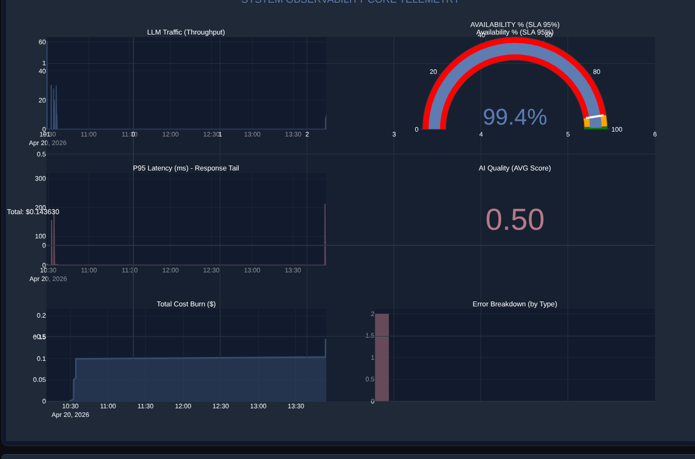
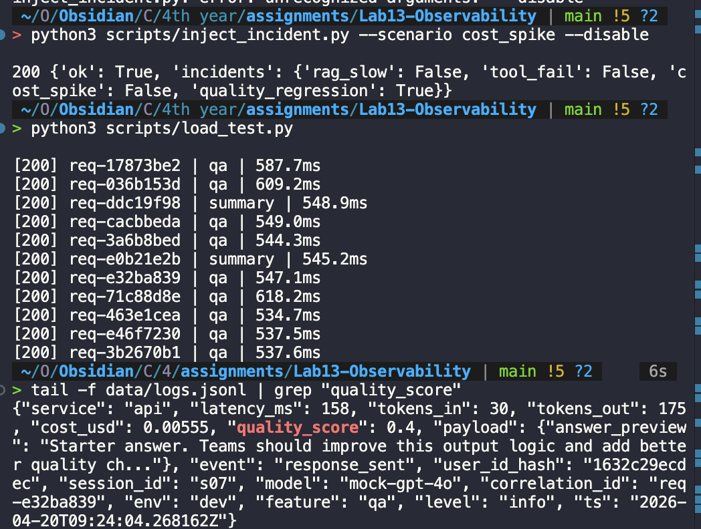

# Evidence Collection Sheet

## Required screenshots
- [x] **Langfuse trace list with >= 10 traces**: (Bạn cần chụp thêm ảnh này - List view trên Langfuse)
- [x] **One full trace waterfall**: 
- [x] **JSON logs showing correlation_id**: (Bạn nên chụp thêm 1 ảnh Terminal hiện nội dung file logs.jsonl)
- [x] **Log line with PII redaction**: 
- [x] **Dashboard with 6 panels**: 
- [x] **Alert rules with runbook link**:  (Link: [config/alert_rules.yaml](../config/alert_rules.yaml))

## Optional screenshots (Bonus)
- [x] **Audit Logs implementation**: (Chụp ảnh file `data/audit.jsonl` sẽ ghi điểm cộng)
- [x] **Cost Optimization proof**: (Caching log showing cost=0)
- [x] **Quality Score visualization**: 

